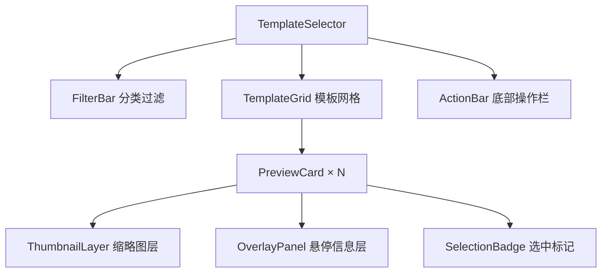

# Design Document

## Overview

本设计描述对 `TemplateSelector` 组件中模板预览卡片的视觉与交互改进。核心变更包括：

1. 卡片宽高比由固定高度（180px）改为与缩略图原始宽高比一致（默认 10:13）
2. 缩略图以 `cover` 方式铺满整个卡片，默认不显示文字覆盖层
3. 鼠标悬停时从底部向上滑出 `OverlayPanel`，展示模板名称与分类标签
4. 保留所有现有交互行为（点击选中、蓝色边框、分类过滤等）

改动范围仅限 `packages/client/src/components/TemplateSelector.tsx`，无需新增文件或修改其他模块。

## Architecture

改动为纯前端 UI 层变更，不涉及状态管理、网络请求或后端逻辑。



`PreviewCard` 内部结构：
- 外层容器：负责宽高比、边框、阴影、overflow:hidden
- `ThumbnailLayer`：background-image cover，绝对定位铺满
- `OverlayPanel`：绝对定位在底部，CSS transform 控制滑入/滑出
- `SelectionBadge`：绝对定位在右上角，仅选中时显示

## Components and Interfaces

### PreviewCard 结构

```tsx
// 外层容器 - 固定宽高比 200:260
<div style={{ aspectRatio: '200 / 260', position: 'relative', overflow: 'hidden', ... }}>
  {/* 内容层 - 绝对定位铺满 */}
  <div style={{ position: 'absolute', inset: 0 }}>
    {/* 缩略图背景 */}
    <div style={{ width: '100%', height: '100%', backgroundImage: `url(...)`, backgroundSize: 'cover' }} />
    
    {/* OverlayPanel - 默认 translateY(100%)，悬停时 translateY(0) */}
    <div style={{
      position: 'absolute', bottom: 0, left: 0, right: 0,
      transform: isHovered ? 'translateY(0)' : 'translateY(100%)',
      transition: 'transform 0.25s ease',
      background: 'rgba(0,0,0,0.65)',
    }}>
      {/* 模板名称 + 分类标签 */}
    </div>
    
    {/* SelectionBadge - 仅选中时显示 */}
    {isSelected && <div style={{ position: 'absolute', top: 8, right: 8 }}>✓</div>}
  </div>
</div>
```

### 宽高比实现方案

直接使用 CSS `aspect-ratio` 属性，固定为 200/260，无需解析缩略图尺寸：

```tsx
// 固定宽高比 200:260，与模板缩略图尺寸一致
<div style={{ aspectRatio: '200 / 260', overflow: 'hidden', position: 'relative', ... }}>
  ...
</div>
```

`aspect-ratio` 是现代 CSS 标准属性，浏览器支持良好，无需额外计算逻辑。

### OverlayPanel 动画

纯 CSS transition，无 JS 定时器：

```tsx
// 容器需要 overflow: hidden 以裁剪滑出的 panel
<div style={{ overflow: 'hidden', position: 'relative' }}>
  <div style={{
    transform: isHovered ? 'translateY(0)' : 'translateY(100%)',
    transition: 'transform 0.25s ease',  // ≤300ms
  }}>
    ...
  </div>
</div>
```

`overflow: hidden` 确保 `translateY(100%)` 状态下 panel 不可见（被裁剪）。

## Data Models

本功能不引入新的数据模型。复用现有类型：

```typescript
// 来自 @resume-editor/shared
interface ResumeTemplate {
  id: string
  name: string
  category: TemplateCategory        // 用于显示分类标签和颜色
  thumbnail?: string                // SVG data URL，用作背景图
  // ...
}

// 组件内部状态（已存在）
const [hoveredTemplate, setHoveredTemplate] = useState<string | null>(null)
const [filterCategory, setFilterCategory] = useState<TemplateCategory | 'all'>('all')
```

## Correctness Properties

*A property is a characteristic or behavior that should hold true across all valid executions of a system — essentially, a formal statement about what the system should do. Properties serve as the bridge between human-readable specifications and machine-verifiable correctness guarantees.*

### Property 1: 卡片固定宽高比 200:260

*For any* PreviewCard, the card element should have `aspect-ratio: 200 / 260` applied, ensuring consistent proportions regardless of container width.

**Validates: Requirements 1.1, 1.2, 1.3**

### Property 2: 悬停状态决定 OverlayPanel 可见性（往返）

*For any* PreviewCard, when the hover state is true the OverlayPanel transform should be `translateY(0)` (visible), and when hover state is false the transform should be `translateY(100%)` (hidden). Toggling hover twice should return to the original state.

**Validates: Requirements 3.1, 3.2**

### Property 3: OverlayPanel 包含模板名称与分类标签

*For any* template, the rendered OverlayPanel should contain the template's name text and a category tag element whose color matches the category's defined color.

**Validates: Requirements 3.3**

### Property 4: 点击任意卡片触发正确回调

*For any* template in the list, clicking its PreviewCard should invoke `onTemplateSelect` exactly once with that template as the argument.

**Validates: Requirements 4.1**

### Property 5: 选中模板显示蓝色高亮边框

*For any* template, when it is the selected template the card border should be `3px solid #3498db`; when it is not selected the border should not be the blue highlight color.

**Validates: Requirements 4.2**

### Property 6: 分类过滤返回正确子集

*For any* category filter value (including 'all'), the displayed templates should be exactly the subset of all templates whose category matches the filter (or all templates when filter is 'all').

**Validates: Requirements 4.3**

## Error Handling

| 场景 | 处理方式 |
|------|----------|
| `thumbnail` 为 `undefined` | 卡片显示空白背景，宽高比仍保持 200:260 |
| `templates` 列表为空 | 网格区域为空，不渲染任何卡片，不报错 |
| `selectedTemplate` 为 `undefined` | 无卡片显示选中状态，确认按钮禁用（现有逻辑保持不变） |

## Testing Strategy

### 单元测试（具体示例与边界条件）

使用 Vitest + React Testing Library，测试文件：`packages/client/src/__tests__/template-card-preview-effect.test.tsx`

- 卡片 `aspect-ratio` 为 `200 / 260`
- `background-size: cover` 样式已应用于缩略图容器
- 默认状态下 OverlayPanel 的 transform 为 `translateY(100%)`
- 选中状态下勾选图标存在于 DOM 中
- OverlayPanel 背景色为 `rgba(0,0,0,0.65)`
- CSS transition duration ≤ 300ms（`0.25s`）
- OverlayPanel 使用 `position: absolute` 而非影响文档流

### 属性测试（Property-Based Testing）

使用 **fast-check**（已在 JS/TS 生态广泛使用）。每个属性测试运行最少 100 次迭代。

测试文件：`packages/client/src/__tests__/template-card-preview-effect.property.test.tsx`

```typescript
// Feature: template-card-preview-effect, Property 1: 卡片固定宽高比 200:260
// For any PreviewCard, aspect-ratio should be '200 / 260'
fc.assert(fc.property(
  arbitraryTemplate(),
  (template) => {
    const { getByTestId } = render(<PreviewCard template={template} ... />)
    const card = getByTestId('preview-card')
    return card.style.aspectRatio === '200 / 260'
  }
), { numRuns: 100 })

// Feature: template-card-preview-effect, Property 2: 悬停状态决定 OverlayPanel 可见性
// For any template, hover=true → translateY(0), hover=false → translateY(100%)
fc.assert(fc.property(
  arbitraryTemplate(),
  fc.boolean(),  // isHovered
  (template, isHovered) => {
    const { getByTestId } = render(<PreviewCard template={template} isHovered={isHovered} ... />)
    const panel = getByTestId('overlay-panel')
    const expected = isHovered ? 'translateY(0)' : 'translateY(100%)'
    return panel.style.transform === expected
  }
), { numRuns: 100 })

// Feature: template-card-preview-effect, Property 3: OverlayPanel 包含模板名称与分类标签
fc.assert(fc.property(
  arbitraryTemplate(),
  (template) => {
    const { getByTestId } = render(<PreviewCard template={template} isHovered={true} ... />)
    const panel = getByTestId('overlay-panel')
    return panel.textContent?.includes(template.name) &&
           panel.querySelector('[data-testid="category-tag"]') !== null
  }
), { numRuns: 100 })

// Feature: template-card-preview-effect, Property 4: 点击任意卡片触发正确回调
fc.assert(fc.property(
  fc.array(arbitraryTemplate(), { minLength: 1, maxLength: 10 }),
  fc.nat(),  // index to click
  (templates, idx) => {
    const target = templates[idx % templates.length]
    const onSelect = vi.fn()
    const { getAllByRole } = render(<TemplateSelector templates={templates} onTemplateSelect={onSelect} ... />)
    fireEvent.click(getAllByRole('button')[idx % templates.length])
    return onSelect.mock.calls.length === 1 && onSelect.mock.calls[0][0].id === target.id
  }
), { numRuns: 100 })

// Feature: template-card-preview-effect, Property 5: 选中模板显示蓝色高亮边框
fc.assert(fc.property(
  fc.array(arbitraryTemplate(), { minLength: 1, maxLength: 10 }),
  fc.nat(),
  (templates, idx) => {
    const selected = templates[idx % templates.length]
    const { getAllByTestId } = render(<TemplateSelector templates={templates} selectedTemplate={selected} ... />)
    const cards = getAllByTestId('preview-card')
    return cards.every((card, i) => {
      const isSelected = templates[i].id === selected.id
      return isSelected
        ? card.style.border === '3px solid #3498db'
        : card.style.border !== '3px solid #3498db'
    })
  }
), { numRuns: 100 })

// Feature: template-card-preview-effect, Property 6: 分类过滤返回正确子集
fc.assert(fc.property(
  fc.array(arbitraryTemplate(), { minLength: 0, maxLength: 20 }),
  fc.oneof(fc.constant('all'), fc.constantFrom('classic', 'modern', 'minimal', 'creative')),
  (templates, category) => {
    const { getAllByTestId, queryAllByTestId } = render(
      <TemplateSelector templates={templates} initialFilter={category} ... />
    )
    const cards = queryAllByTestId('preview-card')
    const expected = category === 'all' ? templates : templates.filter(t => t.category === category)
    return cards.length === expected.length
  }
), { numRuns: 100 })
```

**配置要求**：
- 每个属性测试 `numRuns: 100`（最少迭代次数）
- 每个测试注释标注 `Feature: template-card-preview-effect, Property N: <property_text>`
- 属性测试与单元测试分文件，便于独立运行
